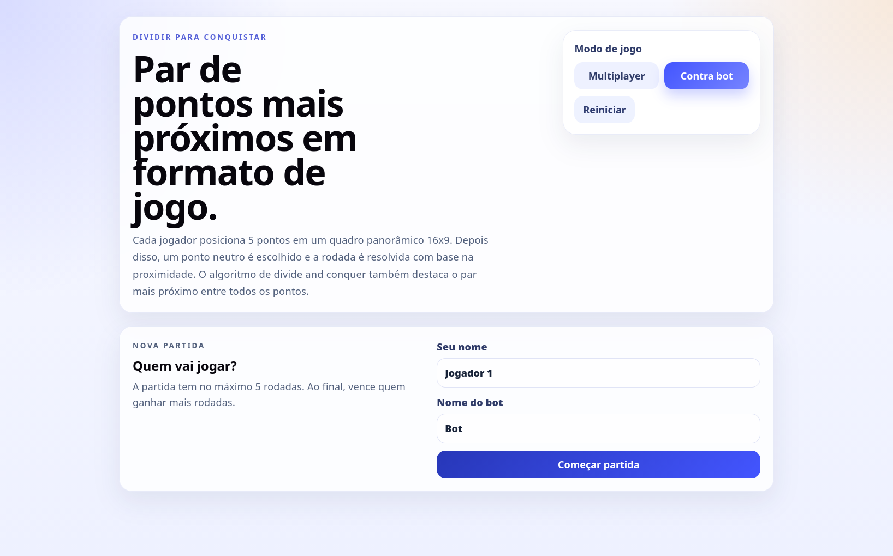
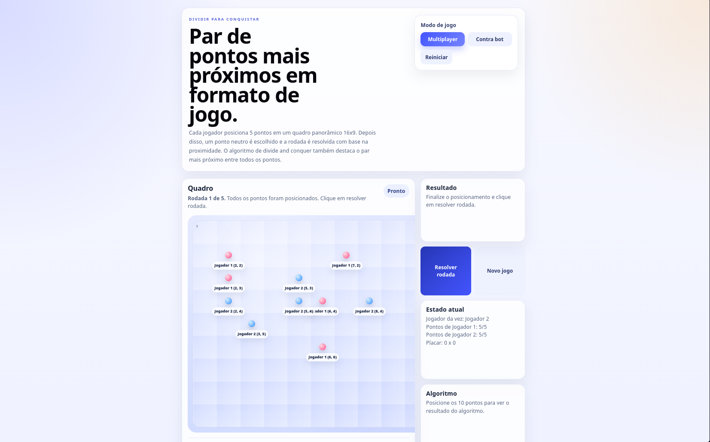
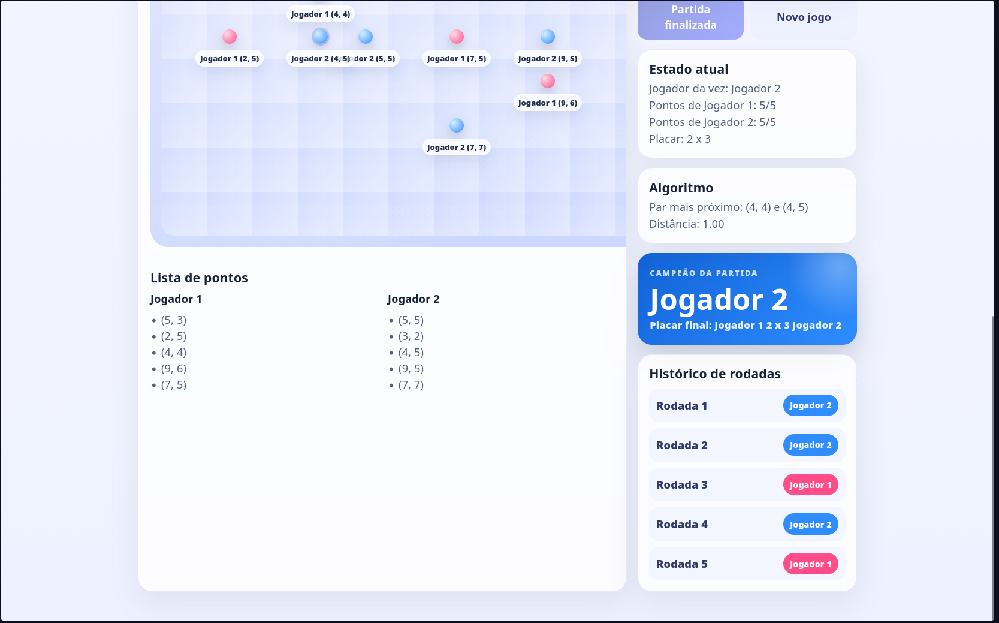
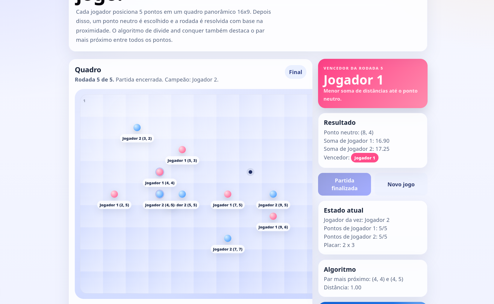

# Closest Pair Game - Dividir e Conquistar

Grupo: 32<br>
Conteúdo da Disciplina: Projeto de Algoritmos - Dividir e Conquistar<br>

## Vídeo de apresentação

A ser adicionado.

## Alunos

| Matrícula  | Aluno                  |
| ---------- | ---------------------- |
| 21/1061565 | Daniel Ferreira Nunes  |
| 21/1061707 | Felipe de Sousa Coelho |

## Sobre

Projeto de visualização interativa do algoritmo de **Par de Pontos Mais Próximos** usando a estratégia de **Dividir e Conquistar**.

O sistema transforma o problema clássico em um jogo competitivo no qual dois jogadores posicionam pontos em um tabuleiro e, ao final da rodada, o algoritmo encontra o par mais próximo entre todos os pontos.

Atualmente o sistema permite:

- **Jogo Competitivo**: Jogador 1 vs Jogador 2 ou Jogador vs Bot
- **Cadastro de Nomes**: Os nomes dos jogadores são informados antes do início da partida
- **Tabuleiro 16x9**: Área panorâmica para posicionamento dos pontos
- **5 Pontos por Jogador**: Cada participante posiciona 5 pontos no quadro
- **Partida com até 5 Rodadas**: O jogo encerra automaticamente na 5ª rodada
- **Modo Multiplayer Local**: Os jogadores alternam a vez para escolher as posições
- **Modo Contra Bot**: O jogador posiciona seus pontos e o bot completa automaticamente
- **Ponto Neutro Aleatório**: Ao resolver a rodada, um ponto neutro é sorteado no tabuleiro
- **Cálculo de Pontuação**: Vence quem tiver a menor soma de distâncias até o ponto neutro
- **Algoritmo Divide and Conquer**: O par de pontos mais próximos é calculado com divisão recursiva do conjunto
- **Lista de Pontos abaixo do Quadro**: Os pontos escolhidos por cada jogador ficam visíveis logo abaixo do tabuleiro panorâmico
- **Destaque Visual do Resultado**: A interface mostra o ponto neutro, o vencedor da rodada, as pontuações e o par mais próximo
- **Histórico de Rodadas**: Cada rodada resolvida é registrada com seu vencedor
- **Campeão da Partida**: Ao final das 5 rodadas, o sistema mostra quem venceu mais rodadas

## Screenshots

# Imagem 1 - Tela inicial com escolha do modo e nomes dos jogadores:



# Imagem 2 - Quadro panorâmico com pontos posicionados e lista de pontos:



# Imagem 3 - Vencendor da rodada destacado com ponto neutro e par mais próximo:



# Imagem 4 - Resultado da rodada com vencedor destacado:




## Exemplo de Lista de Pontos

Jogador 1:

- (6, 5)
- (4, 4)
- (8, 7)
- (5, 3)
- (3, 7)

Jogador 2:

- (4, 5)
- (7, 4)
- (6, 7)
- (2, 4)
- (6, 8)

## Instalação

Linguagens: JavaScript, HTML, CSS

Framework: React

```bash
npm install
npm run dev
```

Acesse `http://localhost:5173` no navegador.

## Uso

1. Escolha o modo de jogo: **Multiplayer** ou **Contra bot**.
2. Informe o nome dos jogadores. No modo contra bot, também é possível alterar o nome do bot.
3. Clique em **Começar partida**.
4. No modo multiplayer, os jogadores alternam a vez posicionando pontos no tabuleiro.
5. No modo contra bot, posicione os 5 pontos do jogador humano e o bot completará automaticamente os próprios pontos.
6. Posicione 5 pontos para cada jogador.
7. Acompanhe a **Lista de pontos** abaixo do quadro panorâmico.
8. Clique em **Resolver rodada** para sortear o ponto neutro e calcular o resultado.
9. Veja a soma das distâncias de cada jogador até o ponto neutro.
10. Confira o vencedor da rodada e o histórico da partida.
11. Clique em **Próxima rodada** para continuar.
12. Ao final de 5 rodadas, veja o campeão da partida.
13. Clique em **Novo jogo** ou **Reiniciar** para começar novamente.

## Algoritmo

O algoritmo usado para encontrar o par de pontos mais próximos segue a abordagem de Dividir e Conquistar:

1. Ordena os pontos pelo eixo X e pelo eixo Y.
2. Divide o conjunto de pontos em duas metades.
3. Resolve recursivamente o menor par em cada metade.
4. Compara os melhores resultados das metades.
5. Analisa a faixa central entre as divisões para encontrar pares que cruzam a separação.
6. Retorna o par com a menor distância encontrada.
